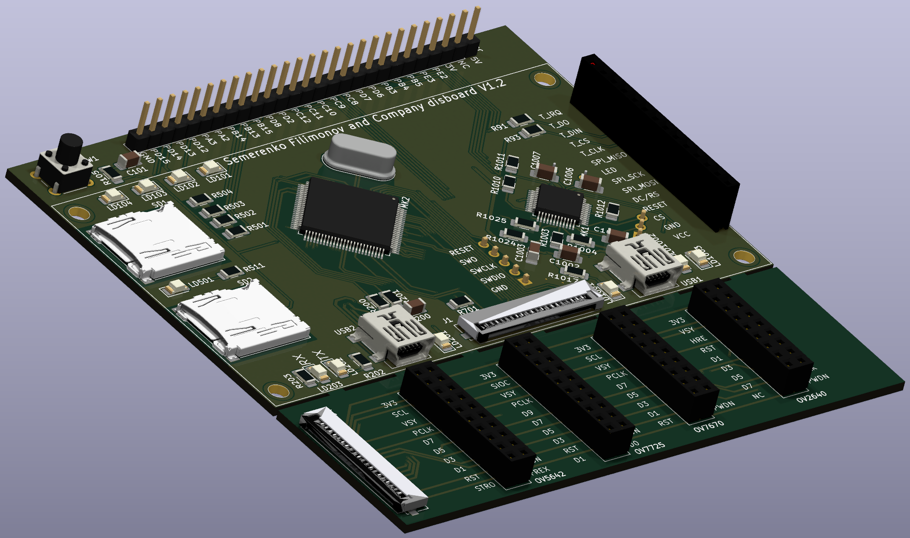

# Схемотехнические решения РЭС

Из всех пар по схематехники, электронике, проектированию. Только на этом предмете стало понятно что такое электроника.

В ходе семестра была разработана печатная плата:

Преподаватель:

* Денис Алексеевич Семеренко
